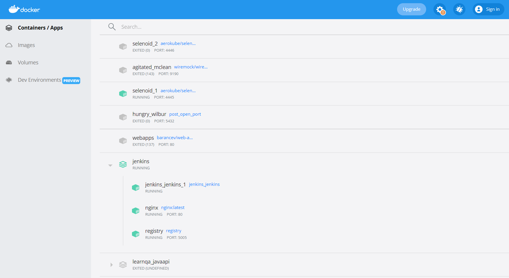
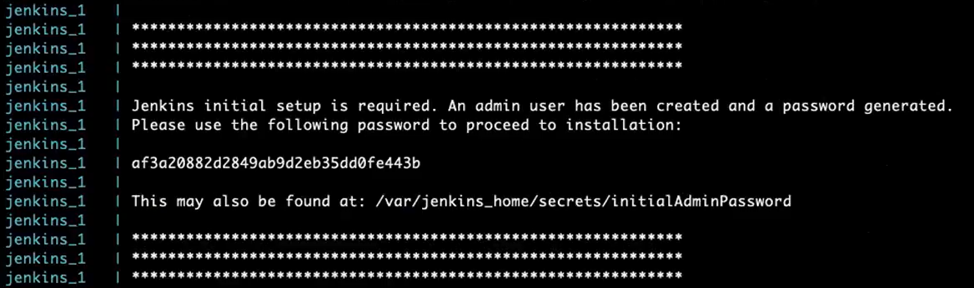
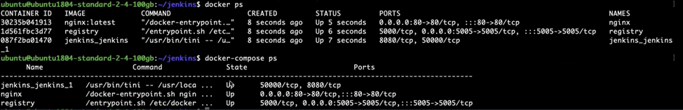
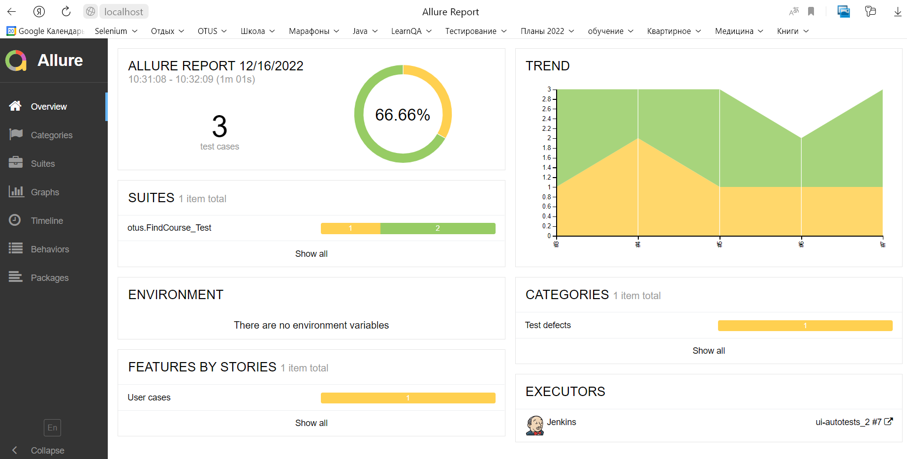

# CI/CD - Запуск тестов на Jenkins

Проект содержит:
- конфиги для настройки docker-compose для Jenkins
- конфиги для генерации job-ов в Jenkins
- скрипт генерации pipeline для запуска UI-тестов на Selenoid
- настройку Allure-отчетности


## Быстрый старт:
1. В приложении Docker Desktop запустить:
- docker-compose jenkins 
- контейнер с Selenoid_1

2. Поднять Selenoid UI для мониторинга работы тестов внутри Selenoid (необязательно).

- Для этого из директории c:\Work\OTUS\Selenoid\ggr_config\ нужно выполнить команду
```
start /b selenoid-ui_windows_amd64.exe --selenoid-uri http://127.0.0.1:4445 -listen ":8090" -allowed-origin "*"
```
- После выполнения команды сомандную строку не закрывать. 
- Selenoid UI будет доступен по адресу: http://127.0.0.1:8090/
3. Авторизоваться в Jenkins: http://localhost/ (admin/admin)
4. Собрать с параметрами по-умолчанию сборку для job **ui_autotests**
5. Мониторинг выполнения сборки по этапам:

- Checkout - коннект к репозиторию с тестами на git и checkout его на docker-образ Jenkins
- Running UI tests - выгрузка всех зависимостей maven и запуск тестов. Для каждого теста будет подниматься образ selenoid с настроенной версией обозревателя.
- reports - генерация allure-отчетов из директории ./allure_results/

- Мониторим процессы, виидим, что подняты контейнеры динамического сборщика maven-slave и один контейнера Selenoid с chrome v.104.0

6. Проверяем генерацию Allure Report


## Конфигурация docker-compose Jenkins

## Настройки Jenkins
1. Настройка Credential:
- Настроить Jenkins → Manage Credential
- выбрать домен global → Add credential
```
Kind = Username with password 
Scope = Global
Username = {username from gitHub}
Password = {password from gitHub}
ID = jenkins
Description = jenkins
```

## Настройка шаблонов для генерации job


## Скрипт* генерации pipeline
_*Ссылка на этот скрипт задается в шаблоне job._

[Скрипт генерации pipeline для UI тестов](jenkins/ui_autotests.groovy) содержит:

- **Stage('checkout')** - коннект к репозиторию с тестами на gitHub.
Настройка производится через [макрос](vscode/config/jobs/macroses/git-macroses-jenkins.yaml), в котором задан
способ коннекта к gitHub. В данном случае по протоколу http с заданием логина/пароля в credentional = jenkins


- **Stage('Running UI tests')** - запуск тестов командой maven c указанием параметров:
```
-Dbase.url=${BASE_URL} - адрес тестируемого сайта www.otus.ru
-Dbrowser=${BROWSER_NAME} - название браузера (chrome или opera)
-Dbrowser.version=${BROWSER_VERSION} - версии браузера (chrome 104.0, 103.0; opera 88.0)
-Dfilter=${FILTER} - фильтр курсов по названию. По умолчанию null - вывод всех курсов.
```
Параметры настраиваются в [pom.xml](pom.xml) и в конфиге [шаблона job](vscode/config/jobs/templates/ui_autotests_2.yaml)
Далее каждый раз при сборке job с параметрами их значения можно корректировать.

Для каждого теста будет подниматься образ selenoid с настроенной версией обозревателя. 
> Url на **Selenoid** задается в [pom.xml](pom.xml) параметром 
> 
>><webdriver.remote.url> http://127.0.0.1:4445/wd/hub </webdriver.remote.url> 
> 
>Для того чтобы тесты выполнялись на локальной машине, нужно параметр сбросить в null.

Настройка Selenoid_1 описана в [readme Otushome_4](https://github.com/nmochalova/Otushome_4).
Для него подгружены слои трех обозревателей [Chrome v.103.0, v.104.0 и Opera v.88.0](vscode/browser.json)

- **Stage('reports')** - генерация allure-отчетов из директории ./allure_results/


## Настройка Allure Reports 
1. В java-проекте должны быть произведены все настройки для Allure - см. [pom.xml](pom.xml)
2. Для читаемости отчетов необходимо проставить тэги allure по коду выполнения тестов.
3. В Jenkins установить [Allure Plugin](https://plugins.jenkins.io/allure-jenkins-plugin/)
4. В Jenkins необходимо настроить установку Allure Commandline:
- Перейти в "Настроить Jenkins" → "Конфигурация глобальных инструментов"
- В блоке Allure Commandline нажать кнопку Add Allure Commandline
- В поле Name вписать наименование Allure Commandline, например, Allure 2.20.1
- Выбрать версию библиотеки, которая будет выкачана из Maven central, например, 2.20.1
3. Конфигурим Job для сборки отчета:
- Создать тестовый job свободной конфигурацией.
- В разделе Post-build Actions нажать кнопку Add post-build action → Allure Report
- В поле Results указать путь до директории «allure-results» 
4. После выполнения всех настроек запустите свою джобу. 
5. После ее выполнения в блоке Build History напротив номера сборки появится значок Allure, 
кликнув по которому, вы увидите сформированный html-отчет (пустой).

Эти манипуляции позволяют закачать нужные зависимости. 
Теперь будет работать генерация allure-отчетов через stage('report') в скрипте pipeline 
