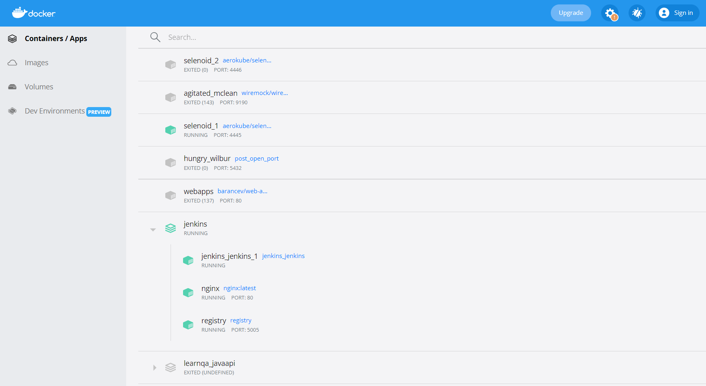
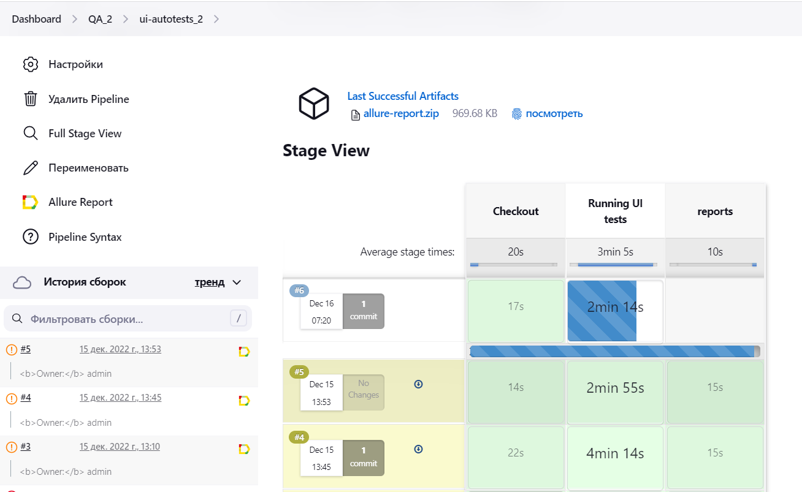
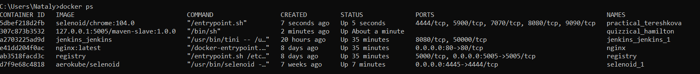
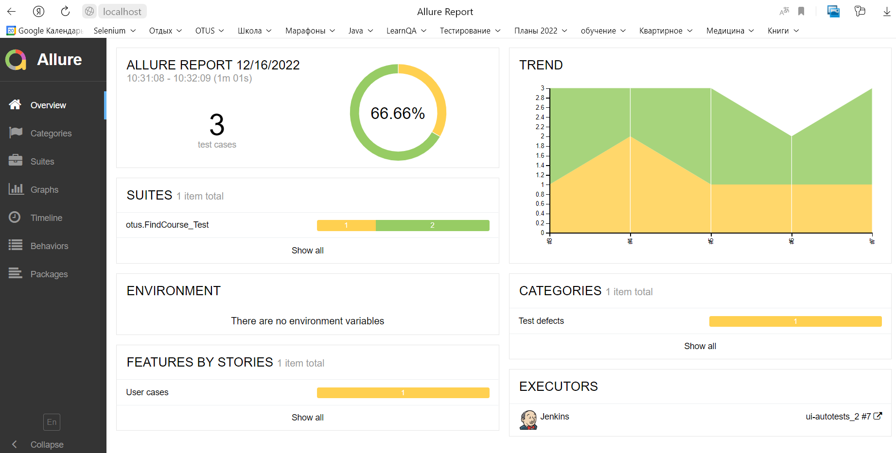
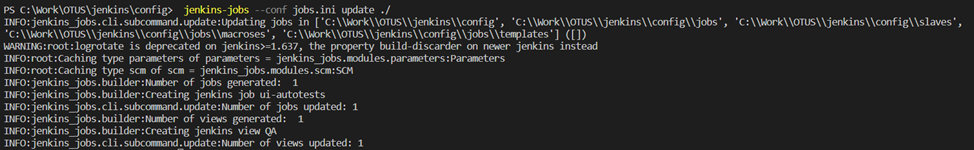

# CI/CD - Запуск тестов на Jenkins

Проект содержит:
- UI-тесты
- конфиги для настройки docker-compose для Jenkins
- настройку динамического сборщика maven-slave
- конфиги для генерации job-ов в Jenkins по шаблону
- скрипт генерации pipeline для запуска UI-тестов на Selenoid
- настройку Allure-отчетности


## Быстрый старт:
1. В приложении Docker Desktop запустить:
- docker-compose jenkins 
- контейнер с Selenoid_1

2. Поднять Selenoid UI для мониторинга работы тестов внутри Selenoid (необязательно).

- Для этого из директории c:\Work\OTUS\Selenoid\ggr_config\ нужно выполнить команду
```
start /b selenoid-ui_windows_amd64.exe --selenoid-uri http://127.0.0.1:4445 -listen ":8090" -allowed-origin "*"
```
- После выполнения команды сомандную строку не закрывать. 
- Selenoid UI будет доступен по адресу: http://127.0.0.1:8090/
3. Авторизоваться в Jenkins: http://localhost/ (admin/admin)
4. Собрать с параметрами по-умолчанию сборку для job **ui_autotests**
5. Мониторинг выполнения сборки по этапам:

- Checkout - коннект к репозиторию с тестами на git и checkout его на docker-образ Jenkins
- Running UI tests - выгрузка всех зависимостей maven и запуск тестов. Для каждого теста будет подниматься образ selenoid с настроенной версией обозревателя.
- reports - генерация allure-отчетов из директории ./allure_results/

- Мониторим процессы, виидим, что подняты контейнеры динамического сборщика maven-slave и один контейнера Selenoid с chrome v.104.0

6. Проверяем генерацию Allure Report


## Конфигурация docker-compose Jenkins
1. Создаем директорию Jenkins/
2. Кладем в нее файл [docker-compose.yml](vscode/docker-compose.yml)
3. Создадим директорию jenkins/nginx и в ней файл [Jenkins.conf](vscode/nginx/jenkins.conf)
4. Создаем директорию Jenkins/config и в ней файл [Dockerfile](vscode/config/Dockerfile)
5. Запускаем из директории, в которой находится docker-compose.yml командой
```
   docker-compose up -d
```
6. Проверяем

7. Проверяем что создалась директория jenkins/registry

## Настройки Jenkins
1. Первоначальный запуск Jenkins:
- Открываем Jenkins в обозревателе по http://localhost/
- Вводим ключ авторизации из логов
```
docker logs jenkins_jenkins_1
```

- Выбираем режим установки Install suggested plugins
- Создаем пользователя admin/admin
> Все последующие настройки профиля Jenkins должны сохраняться в jenkins_home, это настраивается в
[docker-compose.yml](vscode/docker-compose.yml) параметр jenkins/volumes.
---
2. Установливаем **плагины** "Настроить Jenkins" → Управление плагинами  → Available plugins:
- Docker
- Allure
- Build user vars

---
3. Настроить Jenkins → Manage Credential настроить **credentional**:
- выбрать домен global → Add credential
- задать параметры:
```
Kind = Username with password 
Scope = Global
Username = {username from gitHub}
Password = {password from gitHub}
ID = jenkins
Description = jenkins
```

## Настройка динамического сборщика 
1. В Jenkins/ создаем директорию slaves/ и в ней [Dockerfile.maven](vscode/config/slaves/Dockerfile.maven) c настройками Maven
2. Заносим slave в registry на этапе разворачивания Jenkins
- Собираем image:
```
docker build -f ./Dockerfile.maven -t 127.0.0.1:5005/maven-slave:1.0.0 .
```
- Пушим образ (ip подсмотрели в [docker-compose.yml](vscode/docker-compose.yml) для registry):
```
  docker push 127.0.0.1:5005/maven-slave:1.0.0
```
- Проверяем, что в Jenkins/registry появилась /docker/ , в котором найдем maven-slave

3. Настраиваем сборщик в Jenkins. Состояние сборщиков → Configure Clouds → Add new cloud  → Docker  → Ввести следующие параметры:
- Name = maven-slave
- Docker HOST URI = unix:///var/run/docker.sock
- Проверяем коннект: Test Connection
- Установить чек-бокс: Enabled
- Container Cap = 10
- Добавляем шаблон:
```
Label = maven-slave
Включить Enabled
Name = maven-slave
Docker-image = 127.0.0.1:5005/maven-slave:1.0.0
```
- Настройки контейнера:
```
Network = host
Pull strategy = Pull once and update latest
```

_Проверяем работу maven-slave:_
- Dashboard  → new Item
- Name = first_job, Создать задачу со свободной конфигурацией
- Label Expression=maven-slave
- Расширенные  → Отображаемое имя = Hello from otus
- Применить.
- Build Steps  → Выполнить команду shell  → mvn --version

Результат: должен подняться образ 127.0.0.1:5005/maven-slave:1.0.0 и выполнить команду mvn --version (проверяем в #Номер_сборки  → Вывод консоли)

> Рекомендуется для статического сборщика master отключить фоновые процессы 
> (Состояние сборщиков → Мастер → Настройки → Количество процессов-исполнителей = 0)

## Настройка шаблонов для генерации job
1. Чтобы пользоваться инструментом для деплоя шаблонов на Jenkins, нужно установить [Python](https://www.python.org/downloads/).
Устанавливаем в директорию текущего пользователя, с заданием путей в PATH
2. Генерить шаблоны будем инструментом [jenkins-job-builder](https://jenkins-job-builder.readthedocs.io/en/latest/installation.html), который есть у Python. Для этого:
- удостоверимся, что вместе с Python установился пакетный менеджер Pip3, который умеет скачивать приложения
```
pip3 –version
```
3. Скачиваем инструмент jenkins-job-builder. Инсталляция инструмента должна пройти в ту же директорию, где установлен Python.
```
pip3 install --user jenkins-job-builder
```
4. Проверяем командой.  
```
jenkins-jobs
```
5. В директории \jenkins\config\ создаем файл [jobs.ini](vscode/config/jobs.ini)
6. Создаем директорию config\jobs со следующими файлами
- [view.yaml](vscode/config/jobs/view.yaml) – описание view и job
- [Project.yaml](vscode/config/jobs/project.yaml) -  включаем job в проект
- [global.yaml](vscode/config/jobs/global.yaml) с определением глобального контекста
7. Создаем директорию \jenkins\config\jobs\templates и в ней создаем шаблон [ui_autotests.yaml](vscode/config/jobs/templates/ui_autotests_2.yaml)
8. Создадим директорию jobs\macroses и в ней макрос [git-macroses-jenkins.yaml](vscode/config/jobs/macroses/git-macroses-jenkins.yaml)
с доступом по http к репозиторию gitHub, а также с указанием credantional, в котором будут храниться логин и пароль и который будет настраиваться в Jenkins.
9. Из директории Jenkins/Config запускаем генерацию job по шаблону:
```
jenkins-jobs --conf jobs.ini update ./
```

10. Проверяем, что в Jenkins появилось view=QA и создался job = ui_autotests

## Скрипт* генерации pipeline
_*Ссылка на этот скрипт задается в [шаблоне job]([ui_autotests.yaml](vscode/config/jobs/templates/ui_autotests_2.yaml))._

[Скрипт генерации pipeline для UI тестов](jenkins/ui_autotests.groovy) содержит:

- **Stage('checkout')** - коннект к репозиторию с тестами на gitHub.
Настройка производится через [макрос](vscode/config/jobs/macroses/git-macroses-jenkins.yaml), в котором задан
способ коннекта к gitHub. В данном случае по протоколу http с заданием логина/пароля в credentional = jenkins (см. Настройки Jenkins )


- **Stage('Running UI tests')** - запуск тестов командой maven c указанием параметров:
```
-Dbase.url=${BASE_URL} - адрес тестируемого сайта www.otus.ru
-Dbrowser=${BROWSER_NAME} - название браузера (chrome или opera)
-Dbrowser.version=${BROWSER_VERSION} - версии браузера (chrome 104.0, 103.0; opera 88.0)
-Dfilter=${FILTER} - фильтр курсов по названию. По умолчанию null - вывод всех курсов.
```
Параметры настраиваются в [pom.xml](pom.xml) и в конфиге [шаблона job](vscode/config/jobs/templates/ui_autotests_2.yaml)
Далее каждый раз при сборке job с параметрами их значения можно корректировать.

Для каждого теста будет подниматься образ selenoid с настроенной версией обозревателя. 
> Url на **Selenoid** задается в [pom.xml](pom.xml) параметром 
> 
><webdriver.remote.url> http://127.0.0.1:4445/wd/hub </webdriver.remote.url> 
> 
>Для того чтобы тесты выполнялись на локальной машине, нужно параметр сбросить в null.

Настройка Selenoid_1 описана в [readme Otushome_4](https://github.com/nmochalova/Otushome_4).
Для него подгружены слои трех обозревателей Chrome v.103.0, v.104.0 и Opera v.88.0 - [browser.json](vscode/browser.json)

- **Stage('reports')** - генерация allure-отчетов из директории ./allure_results/


## Настройка Allure Reports 
1. В java-проекте должны быть произведены все настройки для Allure - см. [pom.xml](pom.xml)
2. Для читаемости отчетов необходимо проставить тэги allure по коду выполнения тестов.
3. В Jenkins установить [Allure Plugin](https://plugins.jenkins.io/allure-jenkins-plugin/)
4. В Jenkins необходимо настроить установку Allure Commandline:
- Перейти в "Настроить Jenkins" → "Конфигурация глобальных инструментов"
- В блоке Allure Commandline нажать кнопку Add Allure Commandline
- В поле Name вписать наименование Allure Commandline, например, Allure 2.20.1
- Выбрать версию библиотеки, которая будет выкачана из Maven central, например, 2.20.1
3. Конфигурим Job для сборки отчета:
- Создать тестовый job свободной конфигурацией.
- В разделе Post-build Actions нажать кнопку Add post-build action → Allure Report
- В поле Results указать путь до директории «allure-results» 
4. После выполнения всех настроек запустите свою джобу. 
5. После ее выполнения в блоке Build History напротив номера сборки появится значок Allure, 
кликнув по которому, вы увидите сформированный html-отчет (пустой).

Эти манипуляции позволяют закачать нужные зависимости. 
Теперь будет работать генерация allure-отчетов через stage('report') в скрипте pipeline 
